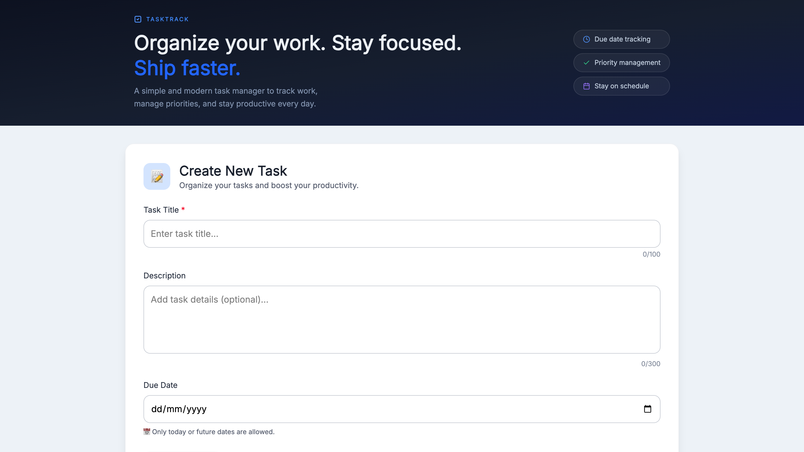
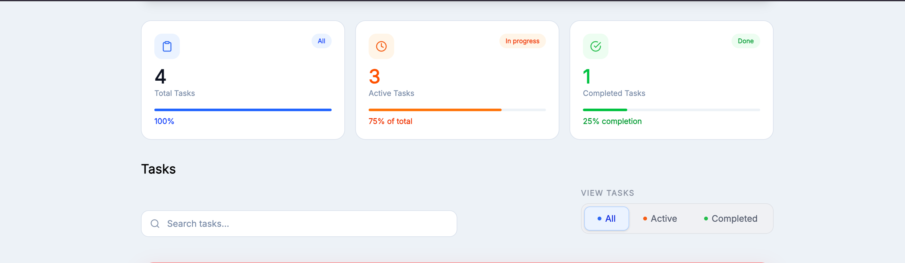
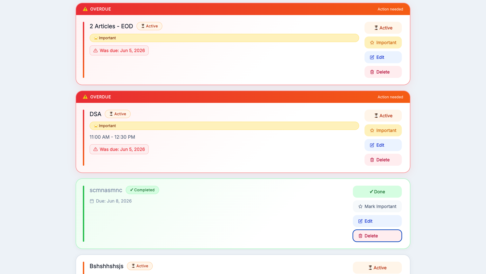

# 🚀 TaskTrack

### Modern Full-Stack Task Management Application

TaskTrack is a modern productivity-focused task management platform built using **React, Node.js, Express.js, and MongoDB Atlas**. It helps users organize tasks, manage priorities, track deadlines, and improve productivity through a clean, responsive, and intuitive user experience.

### 🔗 Quick Links

🌐 **Live Demo:** https://task-track-sand.vercel.app/

⚡ **Backend API:** https://tasktrack-qovl.onrender.com/tasks

📂 **GitHub Repository:** https://github.com/Vikash7080/TaskTrack

---

## 🎯 Project Highlights

* Full Stack MERN Architecture
* RESTful API Integration
* MongoDB Atlas Cloud Database
* Drag & Drop Task Reordering
* Due Date Tracking & Overdue Alerts
* Priority-Based Task Management
* Search & Filter Functionality
* Responsive Mobile-Friendly Design
* Production Deployment (Vercel + Render)

---

## 📸 Screenshots

### Task Creation Form



### Task Statistics Dashboard



### Task List Management



---

## ✨ Features

### 📝 Task Management

* Create, edit, and delete tasks
* Mark tasks as completed
* Mark tasks as important
* Reorder tasks with drag-and-drop support
* Persistent task storage

### 📅 Productivity Features

* Due date management
* Overdue task detection
* Task prioritization
* Search tasks instantly
* Filter by status
* Real-time statistics dashboard

### 🎨 User Experience

* Modern and clean UI
* Fully responsive design
* Toast notifications
* Confirmation dialogs
* Mobile-friendly interface

### ☁️ Data & Infrastructure

* MongoDB Atlas integration
* REST API architecture
* Cloud deployment
* Production-ready setup

---

## 🛠️ Tech Stack

### Frontend

* React
* Vite
* Tailwind CSS
* Axios
* React Hot Toast
* SweetAlert2
* React Icons
* @hello-pangea/dnd

### Backend

* Node.js
* Express.js
* MongoDB Atlas
* Mongoose

### Deployment

* Vercel (Frontend)
* Render (Backend)

---

## 📂 Project Structure

```text
TaskTrack
│
├── client
│   ├── src
│   │   ├── components
│   │   ├── services
│   │   └── App.jsx
│   │
│   └── public
│
├── server
│   ├── config
│   ├── models
│   ├── routes
│   └── index.js
│
├── screenshots
│
└── README.md
```

---

## ⚙️ Local Development Setup

### Clone Repository

```bash
git clone https://github.com/Vikash7080/TaskTrack.git
cd TaskTrack
```

### Backend Setup

```bash
cd server
npm install
```

Create `.env`

```env
MONGO_URI=your_mongodb_connection_string
```

Run Backend

```bash
npm run dev
```

### Frontend Setup

```bash
cd client
npm install
npm run dev
```

---

## 🔌 API Endpoints

| Method | Endpoint             | Description       |
| ------ | -------------------- | ----------------- |
| GET    | /tasks               | Fetch all tasks   |
| POST   | /tasks               | Create a new task |
| PUT    | /tasks/:id           | Update task       |
| PATCH  | /tasks/:id/toggle    | Toggle completion |
| PATCH  | /tasks/:id/important | Toggle priority   |
| PUT    | /tasks/reorder       | Reorder tasks     |
| DELETE | /tasks/:id           | Delete task       |

---

## 🚀 Deployment Architecture

```text
User
  ↓
Vercel Frontend
  ↓
Render Backend API
  ↓
MongoDB Atlas
```

---

## 🧠 Technical Challenges Solved

* Full-stack CRUD implementation
* Drag & Drop state synchronization
* MongoDB Atlas cloud integration
* REST API architecture
* Responsive UI design
* Production deployment setup
* Cross-platform compatibility
* State management with React Hooks

---

## 📈 Future Roadmap

### Phase 1

* User Authentication (JWT)
* User-specific dashboards
* Password reset functionality

### Phase 2

* Dark Mode
* Categories & Tags
* Calendar View
* Task Reminders

### Phase 3

* Recurring Tasks
* File Attachments
* Activity History
* Productivity Analytics

### Phase 4

* Team Collaboration
* Shared Workspaces
* Role-Based Access Control
* Real-Time Updates using WebSockets

### Phase 5

* Progressive Web App (PWA)
* Email Notifications
* AI-Based Productivity Insights
* Mobile Application

---

## 👨‍💻 Author

### Vikash Sengar

B.Tech Student | Full Stack Developer

GitHub: https://github.com/Vikash7080

---

## ⭐ Support

If you found this project useful, consider giving it a ⭐ on GitHub.
